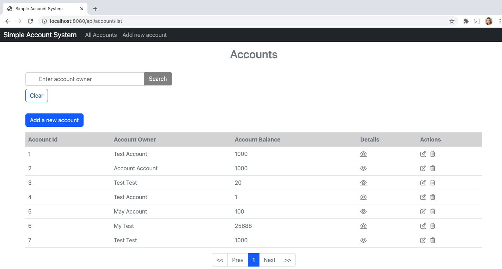
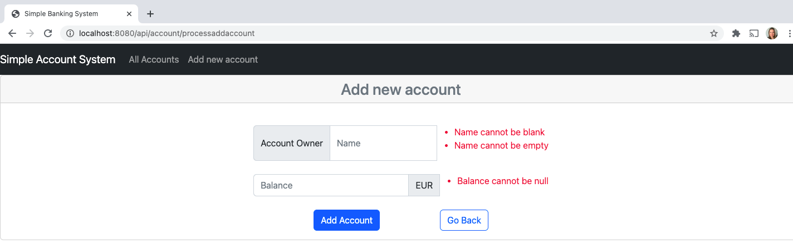
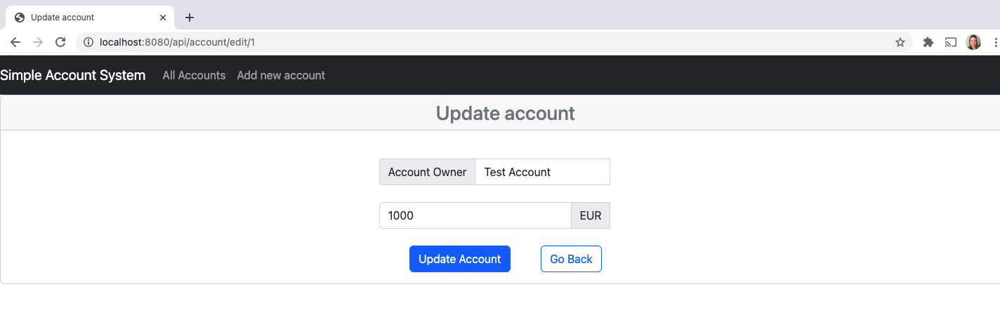
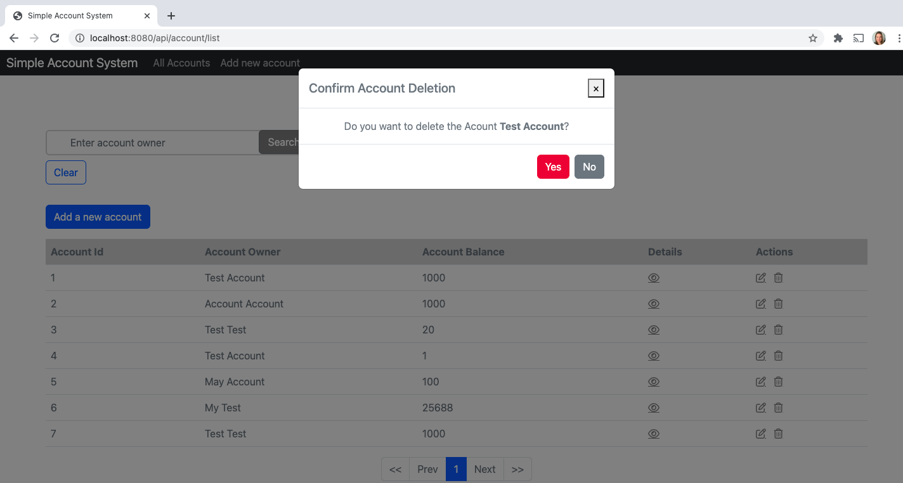
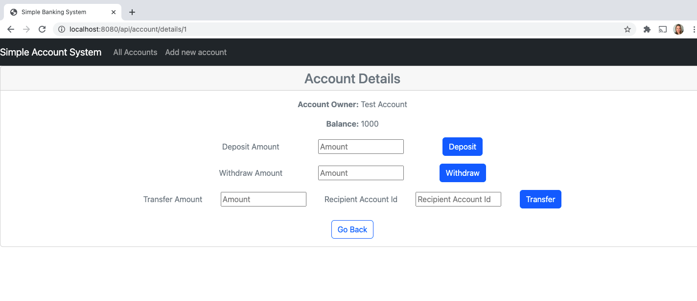

# account-app
Simmple account app

***
### Description
Simple account app create, update, delete account, get all acounts, deposit, withdraw, trasnfer.
This iplemetation has UI.
Possibility make transfer via rest request to external bank API (no UI).
The project is for learning purpose.  

### Technology Stack
Component         | Technology
---               | ---
Frontend          | Thymeleaf, Bootstrap 5.2.3, JQuery 3.6.4
Backend           | Spring Boot 3.1.2, Java 17
Database          | SQLite Database (in memory)
Server            | TomcatApache 9.+
API Doc           | Swagger-UI

### screenshots
Home page info

  

Add Account info

  

Edit Account info

  

Delete Account modal

  

Details view info

  

### Prerequisites
-  Clone the repo `https://github.com/VaivaSvegzdaite/svs-app.git`

### Backend and Frontend
- Go to your project folder from your terminal
- Run: `mvn spring-boot:run`

### Database 
- database configuration in application.properties file

### Swagger UI
- http://localhost:8080/swagger-ui/index.html
